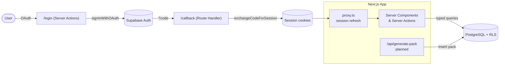

# ContextForge

> Transform any data source — URLs, raw text, GitHub files — into perfectly optimized Markdown **context packs** for LLMs.

ContextForge is a micro‑SaaS that ingests messy inputs and produces clean, token‑efficient context ready to paste into (or stream to) any large language model. This repository contains the full‑stack application: a Next.js App Router frontend/backend, Supabase for database + auth, and a migration‑driven PostgreSQL schema secured with Row Level Security.

---

## Table of contents

- [Status](#status)
- [Features](#features)
- [Tech stack](#tech-stack)
- [Architecture](#architecture)
- [Project structure](#project-structure)
- [Prerequisites](#prerequisites)
- [Quick start](#quick-start)
- [Environment variables](#environment-variables)
- [Database & Supabase setup](#database--supabase-setup)
- [Authentication](#authentication)
- [npm scripts](#npm-scripts)
- [Schema validation (no Docker required)](#schema-validation-no-docker-required)
- [Deploying to Vercel](#deploying-to-vercel)
- [Roadmap](#roadmap)
- [License](#license)

---

## Status

ContextForge is under active construction. The **foundation is complete and verified** (`next build` passes); feature pages are being layered on top.

| Area | State |
| --- | --- |
| Next.js + TypeScript + Tailwind scaffold | ✅ Done |
| Supabase browser/server clients (typed) | ✅ Done |
| Database schema + RLS migration | ✅ Written & validated |
| GitHub / Google OAuth (login, callback, session refresh) | ✅ Done |
| Dashboard (list / create / view packs) | 🚧 Planned |
| `generate-pack` extraction engine | 🚧 Planned |

---

## Features

- **Multi‑source ingestion** — GitHub files, URL scrapes, raw text, and Notion (schema‑ready).
- **Optimized context packs** — stored as clean Markdown with a token count for budgeting.
- **Secure by default** — every table is protected with Row Level Security so users only ever see their own data.
- **OAuth sign‑in** — GitHub and Google via Supabase Auth.
- **Server‑first** — React Server Components and Server Actions throughout; client components only where interactivity demands it.
- **Strictly typed** — strict TypeScript end‑to‑end, with database queries typed from generated Supabase types (no `any`).

---

## Tech stack

| Layer | Choice |
| --- | --- |
| Framework | [Next.js 16](https://nextjs.org) (App Router, Turbopack) |
| Language | TypeScript (strict) |
| Styling | [Tailwind CSS v4](https://tailwindcss.com) |
| UI components | [shadcn/ui](https://ui.shadcn.com) (Radix primitives) — `cn()` helper ready |
| Database & Auth | [Supabase](https://supabase.com) (PostgreSQL + Supabase Auth) |
| Auth transport | [`@supabase/ssr`](https://supabase.com/docs/guides/auth/server-side/nextjs) |
| Context protocol | [`@modelcontextprotocol/sdk`](https://github.com/modelcontextprotocol) (planned) |
| Hosting | [Vercel](https://vercel.com) |

---

## Architecture



**Request lifecycle:** `proxy.ts` runs on every non‑static request to refresh the Supabase session and keep auth cookies in sync. Server Components and Server Actions then talk to PostgreSQL through a fully typed Supabase client, and Row Level Security guarantees per‑user isolation at the database layer.

---

## Project structure

```text
contextforge/
├── CONTEXTFORGE_SPEC.md          # Source-of-truth spec (stack, schema, layout)
├── scripts/
│   └── validate-schema.mjs       # Runs the migration against embedded Postgres (PGlite)
├── supabase/
│   ├── config.toml               # Supabase CLI project config
│   └── migrations/
│       └── 0001_init.sql         # Tables + RLS + signup trigger
└── src/
    ├── app/
    │   ├── (auth)/
    │   │   ├── login/
    │   │   │   ├── page.tsx       # Login screen (Server Component)
    │   │   │   └── actions.ts     # "use server" OAuth actions
    │   │   └── callback/route.ts  # OAuth code → session exchange
    │   ├── dashboard/             # Pack list / create / view  (planned)
    │   ├── api/generate-pack/     # Extraction engine          (planned)
    │   ├── layout.tsx
    │   └── page.tsx               # Landing page
    ├── components/
    │   ├── ui/                    # shadcn/ui components
    │   └── dashboard/             # Feature components
    ├── lib/
    │   ├── supabase/
    │   │   ├── client.ts          # Browser client  (typed)
    │   │   ├── server.ts          # Server client   (typed)
    │   │   └── middleware.ts      # updateSession() cookie-refresh helper
    │   └── utils.ts               # cn() for shadcn/ui
    ├── types/
    │   └── database.types.ts      # Generated Supabase types
    └── proxy.ts                   # Next.js proxy (session refresh on every request)
```

> **Next.js 16 note:** the root request handler is `src/proxy.ts` (exporting `proxy()`), the successor to the now‑deprecated `middleware.ts` convention. The file under `src/lib/supabase/middleware.ts` is just a helper module and is unaffected.

---

## Prerequisites

- **Node.js 20.9+** (Next.js 16 requirement) and npm.
- A **Supabase** project — free tier is fine. ([Create one](https://supabase.com/dashboard))
- *(Optional)* **Docker Desktop** if you want to run the full Supabase stack locally via the CLI.

---

## Quick start

```bash
# 1. Clone
git clone https://github.com/mitchellray-gh/ContextForge.git
cd ContextForge

# 2. Install dependencies
npm install

# 3. Configure environment
cp .env.example .env.local
#   then edit .env.local with your Supabase URL + anon key (see below)

# 4. Run the dev server
npm run dev
```

Open [http://localhost:3000](http://localhost:3000). The login screen lives at [http://localhost:3000/login](http://localhost:3000/login).

---

## Environment variables

Copy `.env.example` to `.env.local` and fill in the values from **Supabase → Project Settings → API**:

| Variable | Description |
| --- | --- |
| `NEXT_PUBLIC_SUPABASE_URL` | Your project URL, e.g. `https://abcdefgh.supabase.co` |
| `NEXT_PUBLIC_SUPABASE_ANON_KEY` | The public anon / publishable key |

Both are `NEXT_PUBLIC_*` on purpose — they are safe to expose to the browser because access is enforced server‑side by Row Level Security. **Never** commit `.env.local` (it is gitignored); the only committed env file is `.env.example`.

---

## Database & Supabase setup

The schema is defined as a migration in [`supabase/migrations/0001_init.sql`](supabase/migrations/0001_init.sql) and creates three tables — all with RLS enabled and per‑user owner policies:

| Table | Purpose |
| --- | --- |
| `profiles` | Companion to `auth.users`; auto‑created on signup via trigger |
| `data_sources` | Inputs to extract from (`github` · `notion` · `url_scrape` · `raw_text`) |
| `context_packs` | The generated, optimized Markdown packs (+ token count) |

Apply the migration using **one** of the following:

### Option A — Supabase CLI against your cloud project (no Docker)

```bash
npm run db:link          # one-time: links this repo to your Supabase project
npm run db:push          # applies migrations to the linked project
npm run db:types:linked  # regenerates src/types/database.types.ts from the live DB
```

### Option B — Full local stack (requires Docker)

```bash
npm run db:start         # boots local Supabase (Postgres, Auth, Studio…)
npm run db:reset         # applies all migrations to the local database
npm run db:types:local   # regenerates types from the local DB
```

### Option C — Manual

Paste the contents of `supabase/migrations/0001_init.sql` into the **Supabase SQL Editor** and run it.

> After connecting a real database, always regenerate `src/types/database.types.ts` with one of the `db:types:*` scripts so the TypeScript types match the schema exactly.

---

## Authentication

ContextForge uses **Supabase Auth** with OAuth providers. To enable sign‑in:

1. In the Supabase dashboard, go to **Authentication → Providers** and enable **GitHub** and **Google**, adding each provider's client ID/secret.
2. Under **Authentication → URL Configuration**, add your callback URLs to the allow‑list:
   - `http://localhost:3000/callback` (local development)
   - `https://your-app.vercel.app/callback` (production)
3. Start the app and visit `/login`.

**How it flows:** `/login` Server Actions call `signInWithOAuth()` and redirect to the provider → the provider returns to `/callback` → the route handler exchanges the `?code` for a session and sets cookies → `proxy.ts` keeps that session fresh on subsequent requests.

---

## npm scripts

| Script | What it does |
| --- | --- |
| `npm run dev` | Start the Next.js dev server (Turbopack) |
| `npm run build` | Production build (what Vercel runs) |
| `npm run start` | Serve the production build |
| `npm run lint` | Run ESLint |
| `npm run db:validate` | Validate the SQL migration against embedded Postgres — **no Docker** |
| `npm run db:start` / `db:stop` | Start / stop the local Supabase stack (Docker) |
| `npm run db:reset` | Re‑apply all migrations to the local database |
| `npm run db:push` | Push migrations to the linked cloud project |
| `npm run db:diff` | Diff local schema changes into a new migration |
| `npm run db:link` | Link this repo to a Supabase project |
| `npm run db:types:local` / `db:types:linked` | Regenerate `database.types.ts` |

---

## Schema validation (no Docker required)

Because spinning up Docker isn't always possible, this repo ships a self‑contained check that runs the **real migration** against [PGlite](https://github.com/electric-sql/pglite) (PostgreSQL compiled to WebAssembly), behind a small `auth` schema shim:

```bash
npm run db:validate
```

It asserts that all three tables are created, RLS is enabled, every policy exists, the signup trigger provisions a profile, and the `source_type` CHECK constraint rejects invalid values. This makes it a great, fast pre‑commit / CI gate that never touches a real database.

---

## Deploying to Vercel

1. Push this repository to GitHub (already configured — see below).
2. In Vercel, **Add New → Project** and import the `ContextForge` repo. Next.js is auto‑detected, so no `vercel.json` is needed.
3. Add the environment variables under **Settings → Environment Variables**:
   - `NEXT_PUBLIC_SUPABASE_URL`
   - `NEXT_PUBLIC_SUPABASE_ANON_KEY`
   - *(Or use the official [Supabase ↔ Vercel integration](https://vercel.com/integrations/supabase) to sync them automatically.)*
4. Deploy. Then add your Vercel domain's `/callback` URL to the Supabase redirect allow‑list (see [Authentication](#authentication)).
5. Apply the database migration to your production Supabase project with `npm run db:push`.

---

## Roadmap

- [ ] Dashboard: list, create, and view context packs
- [ ] `generate-pack` extraction engine (GitHub / URL / raw text → optimized Markdown)
- [ ] Token counting + budgeting UI
- [ ] Model Context Protocol (MCP) export via `@modelcontextprotocol/sdk`
- [ ] shadcn/ui component library buildout
- [ ] Unit tests (Vitest) for parsing + database logic

---

## License

No license has been declared yet. Until one is added, all rights are reserved by the project owner.
